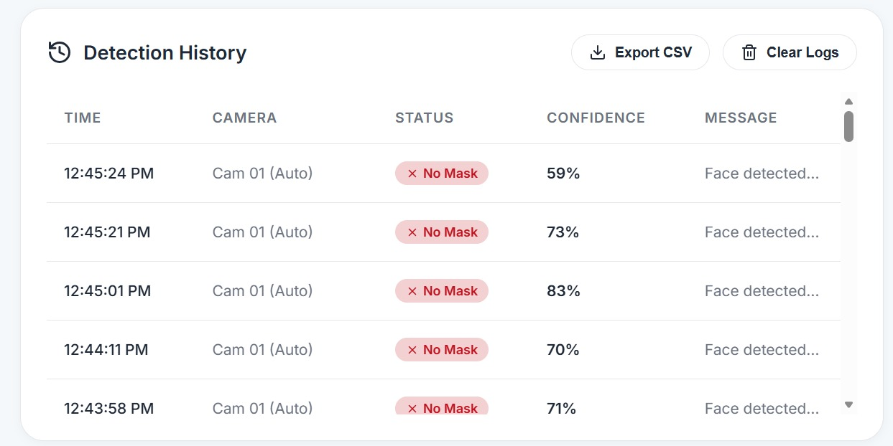

# 🏥 Hospital AI Mask Compliance System

<p align="center">
  
</p>

<p align="center">
An AI-powered web application for real-time face mask compliance monitoring in healthcare environments using <strong>Computer Vision</strong>, <strong>Deep Learning</strong>, and <strong>Flask</strong>.
</p>

<p align="center">


</p>

---

## 📸 Preview


---

# 📖 Overview

The **Hospital AI Mask Compliance System** is a real-time computer vision application designed to monitor mask usage in healthcare facilities such as hospitals, clinics, laboratories, and other high-risk environments.

The system detects faces from live webcam feeds or uploaded images and classifies mask usage into three categories:

- ✅ Correct Mask
- ⚠️ Incorrect Mask
- ❌ No Mask

The application combines **MobileNetV2**, **OpenCV**, and **Flask** to provide an efficient and lightweight solution for mask compliance monitoring through an interactive web dashboard.

---

# ✨ Features

- 🎥 Real-time webcam mask detection
- 🖼️ Image upload and analysis
- 🧠 MobileNetV2-based mask classifier
- 👤 OpenCV DNN face detection
- 📊 Live detection statistics
- 📋 Compliance logging
- 📸 Screenshot capture
- 📄 CSV report export
- 🌐 Responsive web dashboard
- ⚡ Lightweight and fast inference

---

# 🛠 Technology Stack

| Category | Technologies |
|----------|--------------|
| Backend | Python, Flask, Flask-CORS |
| Deep Learning | TensorFlow, Keras, MobileNetV2 |
| Computer Vision | OpenCV DNN |
| Frontend | HTML5, CSS3, JavaScript |
| Icons | Lucide Icons |
| Data | CSV Logging |

---

# 🧠 Detection Categories

| Status | Description |
|---------|-------------|
| ✅ Correct Mask | Mask properly covers nose and mouth |
| ⚠️ Incorrect Mask | Mask worn incorrectly |
| ❌ No Mask | No face covering detected |

---

# 📁 Project Structure

```text
mask_detection/
│
├── advanced_face_detector/
├── dataset/
├── images/
├── logs/
├── src/
│   ├── best_model.h5
│   ├── train_mask_classifier.py
│   └── config.py
│
├── web_app/
│   ├── app_enhanced.py
│   ├── static/
│   └── templates/
│
├── requirements_enhanced.txt
├── setup_and_train_enhanced.bat
└── README.md
```

---

# 🚀 Installation

### Clone the repository

```bash
git clone <repository-url>
cd mask_detection
```

### Create a virtual environment

**Windows**

```bash
python -m venv mask_venv
mask_venv\Scripts\activate
```

**Linux / macOS**

```bash
python3 -m venv mask_venv
source mask_venv/bin/activate
```

### Install dependencies

```bash
pip install -r requirements_enhanced.txt
```

---

# ▶️ Run the Application

Navigate to the web application.

```bash
cd web_app
```

Start the Flask server.

```bash
python app_enhanced.py
```

Open your browser and visit:

```
http://localhost:5000
```

---

# 💻 Usage

### Live Monitoring

- Start webcam detection
- Monitor mask compliance in real time
- View live statistics
- Capture screenshots

### Image Analysis

- Upload an image
- Analyze mask compliance
- View prediction results

### Reports

- Export compliance reports
- Download CSV logs
- Review detection history

---

# 📷 Screenshots

### Dashboard


### Features


### Compliance Logs



---

# 📚 Research Foundation

This project is based on recent research in real-time face mask detection and transfer learning.

Key concepts include:

- MobileNetV2 Transfer Learning
- OpenCV DNN Face Detection
- Multi-class Mask Classification
- Data Augmentation
- Grad-CAM Explainability
- Real-time Deployment

---

# 🔮 Future Improvements

- Multi-camera support
- CCTV integration
- Face recognition
- Alert notifications
- Database storage
- Admin dashboard
- Docker deployment
- Cloud deployment
- REST API authentication

---

# 👨‍💻 Author

**Teena Neupane**

Computer Science Engineer and Data Analyst

---

# 📄 License

This project is licensed under the MIT License.

---

## ⭐ Support

If you found this project helpful, consider giving it a **⭐ Star** on GitHub.
